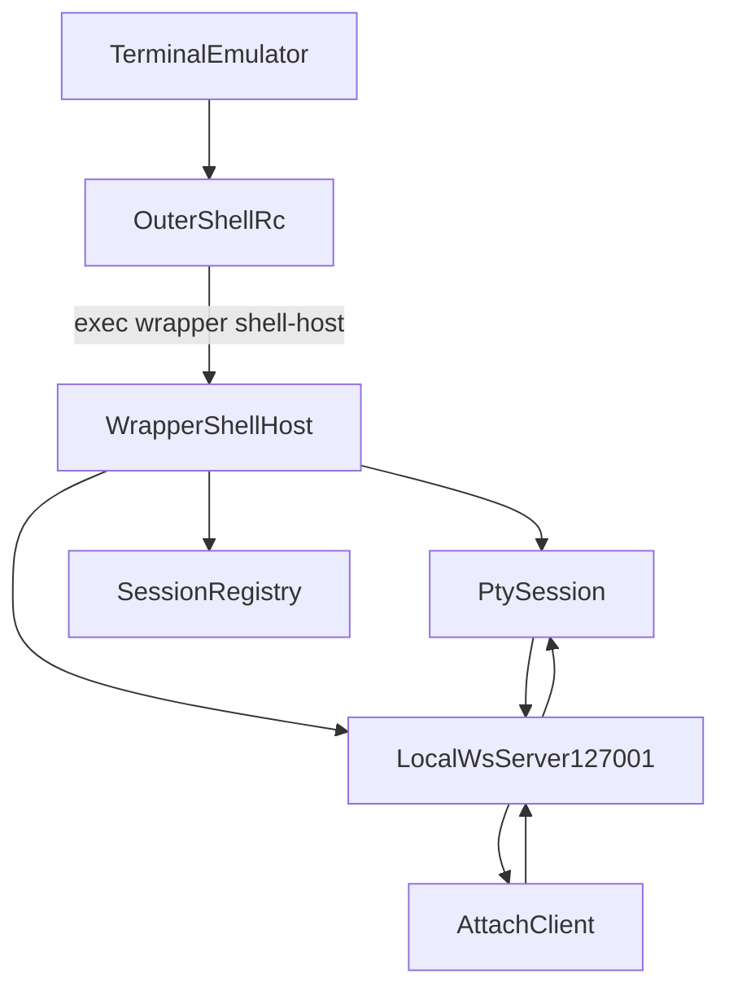
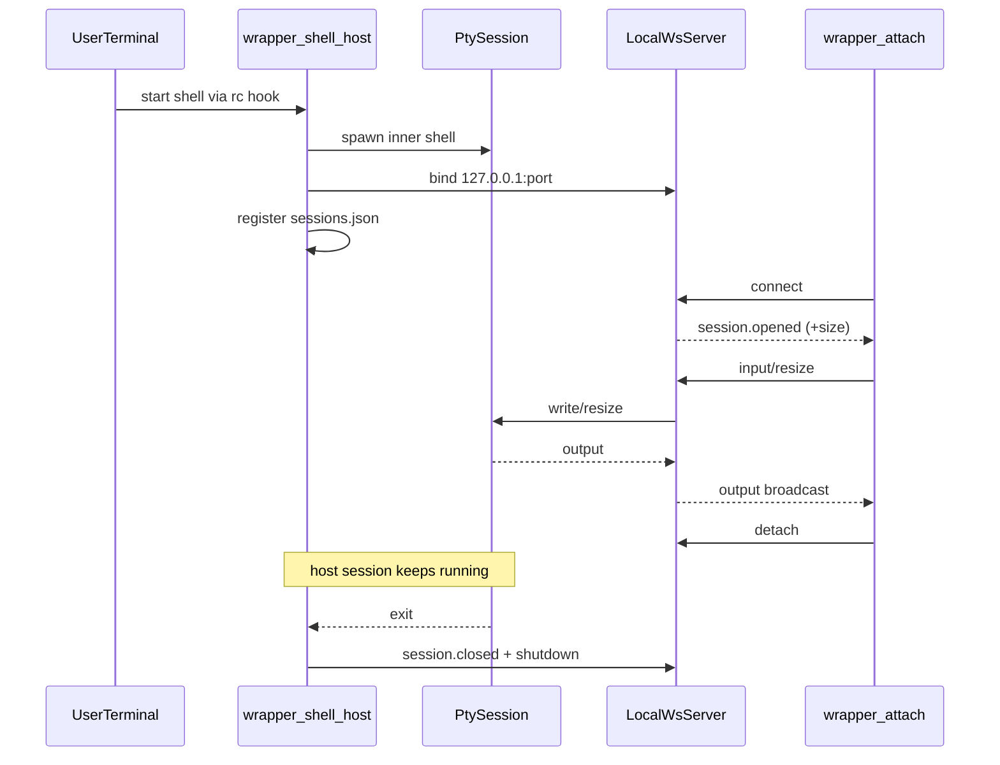

# `@repo/cli` - Wrapper CLI

Wrapper CLI is the runtime core of the product.

It wraps every interactive shell session and exposes that live session over a
local WebSocket endpoint so other clients can attach. It can also publish a
shared session through the relay transport for remote viewers.

This README is a technical walkthrough so you can understand the system while
building.

## Core roles

- `shell-host` is the owner of a session.
- `attach` is a viewer/controller of an existing session.

The host process owns PTY lifecycle, local server, and registry state. Attach
clients are disposable.

## End-to-end architecture



## Session sequence



## How `shell-host` actually works

`commands/shell-host.ts` orchestrates the full host lifecycle:

1. Creates a `sessionId`.
2. Starts `PtySession` (`pty/session.ts`).
3. Starts local server (`server/local.ts`).
4. Registers the session (`registry/sessions.ts`).
5. Starts in-process attach bridge (`client/attach-client.ts`) so the current
   terminal stays interactive.
6. Installs signal handlers and deterministic shutdown.
7. If authenticated, syncs session lifecycle to Convex:
   - host start -> `session:open`
   - periodic tick -> `session:heartbeat`
   - shutdown -> `session:close`
8. On `share`, it issues a relay host ticket and starts a relay bridge.

Important safety guards:

- `WRAPPER_WRAPPED=1` prevents recursive hook execution in inner shell.
- `WRAPPER_NESTING_GUARD=1` kills accidental nested `shell-host` loops.

## How `attach` works

`commands/attach.ts` does:

1. Resolve target session by `--id`, `--port`, or picker from registry.
2. Local path: run `session:authorizeAttach`, then connect to `ws://127.0.0.1:<port>`.
3. Relay path (`--relay` or no local match for `--id`): issue `relay:issueViewerTicket`
   and connect to `WRAPPER_RELAY_URL/ws?ticket=...`.
4. Bridge stdin/stdout via protocol messages.
5. Support detach without ending host session (`Ctrl+\` then `d`).

Detach semantics:

- Detach closes only the viewer socket.
- Host keeps running until inner shell exits.
- Authorization failures are normalized with actionable hints (login required,
  not shared, or session not active).

## Protocol path in local phase

Message types come from `@repo/protocol`.

Main message flow used by CLI:

- `session.opened`
- `input`
- `resize`
- `output`
- `session.closed`
- `error`

`server/local.ts` validates and routes these messages between clients and PTY.

## Commands

### Install and hook management

```bash
wrapper install
wrapper install --all
wrapper install --shell=zsh,bash
wrapper uninstall
wrapper init <shell>
```

`install` writes a managed rc block:

```sh
if [ -z "$WRAPPER_WRAPPED" ] && [ -z "$WRAPPER_DISABLE" ]; then
  exec wrapper shell-host
fi
```

### Daily usage

```bash
wrapper auth login
wrapper auth whoami
wrapper auth logout
wrapper status
wrapper attach
wrapper attach --id <sessionId>
wrapper attach --port <port>
wrapper attach --relay --id <sessionId>
wrapper logs --follow
```

### Internal

```bash
wrapper shell-host
```

### Local development helper

```bash
bun run dev:host
```

## In-session prefix shortcuts

Inside host shell:

| Keys              | Action                    |
| ----------------- | ------------------------- |
| `Ctrl+\` `s`      | mark shared               |
| `Ctrl+\` `u`      | mark unshared             |
| `Ctrl+\` `?`      | status overlay            |
| `Ctrl+\` `Ctrl+\` | send literal control byte |
| `Ctrl+\` `Esc`    | cancel prefix mode        |

Inside attach viewer:

| Keys         | Action        |
| ------------ | ------------- |
| `Ctrl+\` `d` | detach viewer |
| `Ctrl+\` `?` | viewer status |

When shared and authenticated, `Ctrl+\` + `s` starts a relay bridge and enables
remote attach with `wrapper attach --relay --id <sessionId>`.

## Debugging workflow

### Verify host is alive

1. Open wrapped terminal (or run `wrapper shell-host` in dev).
2. Run `wrapper status` from another terminal.
3. Confirm `sessionId`, `pid`, and `port` appear.

### Verify attach path

1. Run `wrapper attach`.
2. Type commands and confirm host shell receives output.
3. Resize the attach terminal and confirm redraw behavior.

### If attach fails

- `wrapper logs --follow`
- verify session registry exists and includes live entry
- verify local port is reachable on `127.0.0.1`
- re-check rc hook installation is single and not duplicated

## Environment variables

| Variable                | Description                        | Default                                      |
| ----------------------- | ---------------------------------- | -------------------------------------------- |
| `NODE_ENV`              | runtime mode (`production` or dev) | unset (treated as dev)                       |
| `CI`                    | enable CI mode                     | unset                                        |
| `WRAPPER_LOG`           | `debug/info/warn/error/off`        | dev=`info`, prod=`warn`                      |
| `WRAPPER_LOG_FILE`      | override log file path             | platform default                             |
| `WRAPPER_TELEMETRY`     | `"false"` disables telemetry       | enabled after consent                        |
| `WRAPPER_POSTHOG_KEY`   | PostHog key                        | empty                                        |
| `WRAPPER_TELEMETRY_URL` | telemetry endpoint                 | `https://telemetry.wrapper.sh`               |
| `WRAPPER_RELAY_URL`     | relay endpoint override            | dev localhost, prod `wss://relay.wrapper.sh` |
| `WRAPPER_AUTH_ORIGIN`   | auth callback origin               | dev localhost, prod `https://wrapper.sh`     |
| `WRAPPER_HUD`           | HUD (`on/off`)                     | `on`                                         |
| `WRAPPER_CONVEX_URL`    | Convex deployment URL for backend  | falls back to `CONVEX_URL` if set            |
| `WRAPPER_DISABLE`       | disable hook in one terminal       | unset                                        |
| `WRAPPER_WRAPPED`       | set by `shell-host` in inner shell | unset                                        |

`NODE_ENV=development` redirects state into `wrapper-dev`, uses localhost defaults, and
mirrors logs to stderr for easier local debugging.

## Source map

```text
index.ts                       commander entrypoint
commands/
  shell-host.ts                host runtime orchestration
  attach.ts                    viewer command
  auth.ts                      device auth login/whoami/logout
  install.ts                   rc install flow
  uninstall.ts                 rc uninstall flow
  init.ts                      snippet generator
  status.ts                    list live sessions
  logs.ts                      tail log file
client/
  attach-client.ts             ws client + tty bridge
server/
  local.ts                     local ws broker
pty/
  session.ts                   pty lifecycle + replay buffer
registry/
  sessions.ts                  local session metadata
relay/
  host-bridge.ts               host relay websocket bridge
shell/
  detect.ts                    shell detection
  rc-edit.ts                   managed rc patcher
  prefix.ts                    prefix parser
util/
  env.ts                       runtime env flags and defaults
  paths.ts                     config/state path helpers
  auth-session.ts              stored auth token + Convex URL resolution
  convex-client.ts             shared authenticated Convex client helper
  feedback.ts                  title/inline/bell notifications
  signals.ts                   signal shutdown helper
```

## Runtime requirements

- Bun >= 1.3.5
- POSIX shells (macOS/Linux)

## Why Bun.Terminal instead of node-pty

`Bun.Terminal` keeps PTY lifecycle in Bun-native APIs and avoids known edge
cases seen with `node-pty` on Bun runtimes.
