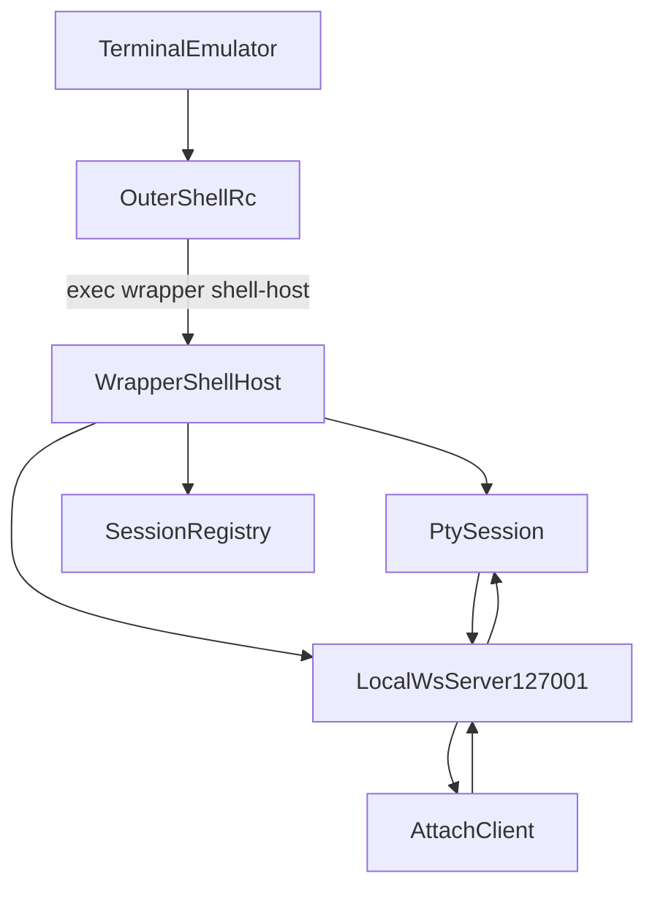
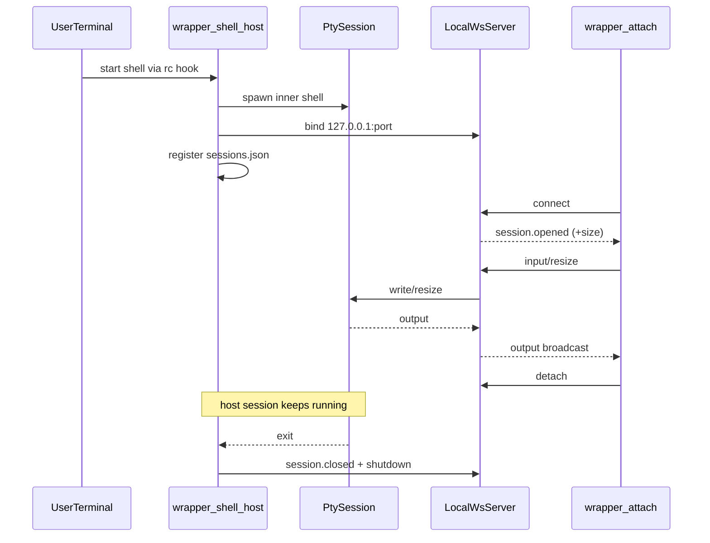

# `@repo/cli` - Wrapper CLI

Wrapper CLI is the runtime core of the product.

It wraps every interactive shell session and exposes that live session over a
local WebSocket endpoint so other clients can attach. It can also publish a
shared session through the relay for remote viewers, with a default direct
WebRTC **P2P fast path** for lower latency (see
[`transport/README.md`](./transport/README.md)).

This README is a technical walkthrough so you can understand the system while
building.

## Core roles

- `shell-host` is the owner of a session.
- `attach` is a viewer/controller of an existing session.

The host process owns PTY lifecycle, local server, and registry state. Attach
clients are disposable.

## End-to-end architecture



## Session sequence



## How `shell-host` actually works

`commands/shell-host.ts` orchestrates the full host lifecycle:

1. Creates a `sessionId`.
2. Starts `PtySession` (`pty/session.ts`).
3. Starts local server (`server/local.ts`).
4. Registers the session (`registry/sessions.ts`).
5. Starts in-process attach bridge (`client/attach-client.ts`) so the current
   terminal stays interactive.
6. Installs signal handlers and deterministic shutdown.
7. If authenticated, syncs session lifecycle to Convex:
   - host start -> `session:open`
   - periodic tick -> `session:heartbeat`
   - shutdown -> `session:close`
8. On `share`, it issues a relay host ticket and starts a relay bridge.
9. It keeps a non-disruptive session HUD in the terminal title and reveals the
   context-specific controls when `Ctrl+\` is armed.

Important safety guards:

- `WRAPPER_WRAPPED=1` prevents recursive hook execution in inner shell.
- `WRAPPER_NESTING_GUARD=1` kills accidental nested `shell-host` loops.

## How `attach` works

`commands/attach.ts` does:

1. Resolve target session by `--id`, `--port`, or picker from registry.
2. Local path: run `session:authorizeAttach`, then connect to `ws://127.0.0.1:<port>`.
3. Relay path (`--relay` or no local match for `--id`): issue
   `relay:issueViewerTicket`. The owner proceeds directly; a non-owner is
   prompted for the share code without echoing it or placing it in shell history.
   The client then connects to `WRAPPER_RELAY_URL/ws?ticket=...`.
4. Bridge stdin/stdout via protocol messages.
5. Support detach without ending host session (`Ctrl+\` then `d`).

Detach semantics:

- Detach closes only the viewer socket.
- Host keeps running until inner shell exits.
- Authorization failures are normalized with actionable hints (login required,
  not shared, or session not active).

## Protocol path in local phase

Message types come from `@repo/protocol`.

Main message flow used by CLI:

- `session.opened`
- `input`
- `resize`
- `output`
- `session.closed`
- `error`

`server/local.ts` validates and routes these messages between clients and PTY.

## Transports: relay + direct P2P

Host and viewer are transport-agnostic, so they exchange `@repo/protocol` frames
through a small `Transport` interface (`transport/transport.ts`), so the wire can
be either:

- **Relay WebSocket** (`WebSocketTransport`), always used, and it also carries WebRTC
  signaling and is the fallback.
- **WebRTC data channel** (`WebRtcDataChannelTransport`), a direct P2P connection
  negotiated over the relay. It is **on by default** (opt out with
  `WRAPPER_P2P=0`). When it opens, viewer input uses the direct low-latency path;
  the host keeps relay output available for fallback and other viewers. If ICE
  cannot connect, the session stays on the relay.

Full design, security model, and testing steps live in
[`transport/README.md`](./transport/README.md). P2P applies only to `--relay`
attaches; local `127.0.0.1` attaches are already direct. A direct connection
exposes each peer's IP to the other, so opt out if that matters for a session.

The active path is visible in the session HUD as `local`, `connecting`, `relay`,
`p2p`, or `offline`. If a P2P channel fails or stays disconnected, the viewer
switches input and output back to the relay immediately. ICE candidates that
arrive before the SDP offer or answer are queued instead of dropped. A live P2P
channel can also keep running if the signaling WebSocket closes.

## Sharing and access

Sharing is capability-based, so only people you explicitly invite can join:

- Pressing `Ctrl+\` `s` marks the session shared and prints a **share code** plus
  the join command. The backend stores only the hash of that code.
- The owner can attach to their own session from any device with no code.
- Anyone else runs `wrapper attach --relay --id <sessionId>` and enters the code
  in a hidden prompt. `--code` exists only for non-interactive automation because
  command-line arguments can appear in process lists and shell history.
- Knowing the session id alone is not enough, and guessing is rate limited per
  account, per hashed target bucket, and globally without exposing whether a
  target exists.
- Pressing `Ctrl+\` `u` (or ending the shell) revokes access immediately by
  clearing the stored code and shared flag.

Behaviors to know once viewers join:

- **Shared control:** every connected viewer can type into the same shell. This
  is intended for pair-prompting. There is no watch-only viewer mode yet.
- **Multiple viewers:** many viewers can attach to one session at once; host
  output is broadcast to all of them (and fanned out over each P2P channel).
- **Consensus resize:** the terminal is sized to the smallest connected viewer,
  so a small window shrinks everyone's view.
- **One host per session:** a second host connecting to the same session id
  replaces the first.

### Local attach security

The local WebSocket server listens on `127.0.0.1`, which any process on the
machine can reach. To stop another local user from attaching to your shell, the
host generates a per-session loopback token, stores it only in the `0600`
registry inside your `0700` config dir, and requires it as `?token=` on every
local connection. `wrapper attach` reads the token from the registry, so only a
user who can read your registry (you, or root) can attach locally. The token is
redacted from logs.

Long-running hosts also keep their backend auth fresh: the short-lived Convex JWT
is re-minted from the stored session token before it expires, so a session that
runs for hours does not start failing its heartbeats.

## Commands

### Install and hook management

```bash
wrapper install
wrapper install --all
wrapper install --shell=zsh,bash
wrapper uninstall
wrapper init <shell>
```

`install` writes a managed rc block:

```sh
if [ -z "$WRAPPER_WRAPPED" ] && [ -z "$WRAPPER_DISABLE" ]; then
  exec wrapper shell-host
fi
```

### Daily usage

```bash
wrapper auth login
wrapper auth whoami
wrapper auth logout
wrapper status
wrapper attach
wrapper attach --id <sessionId>
wrapper attach --port <port>
wrapper attach --relay --id <sessionId>
# Non-interactive automation only:
wrapper attach --relay --id <sessionId> --code "$WRAPPER_SHARE_CODE"
wrapper logs --follow
```

### Internal

```bash
wrapper shell-host
```

### Local development helper

```bash
bun run dev:host
```

## In-session prefix shortcuts

Wrapper prints a one-time controls hint when a host reaches its first idle
prompt and when a viewer attaches. The terminal title then stays updated with
the role, short session id, and active transport. Pressing the prefix key (`Ctrl+\` by default) changes the
title into a context-aware controls menu for 1.5 seconds. Set `WRAPPER_PREFIX`
or `prefix` in `~/.config/wrapper/config.json` to change the prefix.

Wrapper does not reserve a permanent row inside the terminal. A fixed bottom
bar would conflict with alternate-screen applications such as Vim, Neovim,
`less`, `htop`, and tmux. The title-based HUD remains visible without changing
PTY output, shell prompts, or full-screen layouts. If a shell or TUI writes its
own OSC title, Wrapper repaints the session HUD immediately afterward. Set
`WRAPPER_HUD=off` to disable title updates.

Inside host shell:

| Keys              | Action                    |
| ----------------- | ------------------------- |
| `Ctrl+\` `s`      | share + print share code  |
| `Ctrl+\` `u`      | unshare + revoke access   |
| `Ctrl+\` `?`      | status overlay            |
| `Ctrl+\` `Ctrl+\` | send literal control byte |
| `Ctrl+\` `Esc`    | cancel prefix mode        |

Inside attach viewer:

| Keys         | Action        |
| ------------ | ------------- |
| `Ctrl+\` `d` | detach viewer |
| `Ctrl+\` `?` | viewer status |

When shared and authenticated, `Ctrl+\` + `s` starts a relay bridge, prints a
share code, and enables remote attach with
`wrapper attach --relay --id <sessionId>`. Non-owner viewers receive a hidden
share-code prompt.

## Debugging workflow

### Verify host is alive

1. Open wrapped terminal (or run `wrapper shell-host` in dev).
2. Run `wrapper status` from another terminal.
3. Confirm `sessionId`, `pid`, and `port` appear.

### Verify attach path

1. Run `wrapper attach`.
2. Type commands and confirm host shell receives output.
3. Resize the attach terminal and confirm redraw behavior.

### If attach fails

- `wrapper logs --follow`
- verify session registry exists and includes live entry
- verify local port is reachable on `127.0.0.1`
- re-check rc hook installation is single and not duplicated

## Environment variables

| Variable                | Description                                  | Default                                  |
| ----------------------- | -------------------------------------------- | ---------------------------------------- |
| `NODE_ENV`              | `development`/`test` enables isolated dev    | unset (production)                       |
| `CI`                    | enable CI mode                               | unset                                    |
| `WRAPPER_LOG`           | `debug/info/warn/error/off`                  | dev=`info`, prod=`warn`                  |
| `WRAPPER_LOG_FILE`      | override log file path                       | platform default                         |
| `WRAPPER_TELEMETRY`     | explicit telemetry override                  | disabled until user opts in              |
| `WRAPPER_POSTHOG_KEY`   | PostHog key                                  | empty                                    |
| `WRAPPER_TELEMETRY_URL` | telemetry endpoint                           | `https://telemetry.wrapper.sh`           |
| `WRAPPER_RELAY_URL`     | relay endpoint override                      | dev localhost, prod Fly relay            |
| `WRAPPER_AUTH_ORIGIN`   | auth callback origin                         | dev localhost, prod `https://wrapper.sh` |
| `WRAPPER_HUD`           | session title + armed controls HUD           | `on`                                     |
| `WRAPPER_PREFIX`        | in-session prefix (`ctrl+\`, `ctrl+g`)       | `Ctrl+\`                                 |
| `WRAPPER_P2P`           | WebRTC P2P fast path; `0/false/off` opts out | on (relay is the fallback)               |
| `WRAPPER_CONVEX_URL`    | Convex deployment URL for backend            | prod deployment; dev must set it         |
| `WRAPPER_DISABLE`       | disable hook in one terminal                 | unset                                    |
| `WRAPPER_WRAPPED`       | set by `shell-host` in inner shell           | unset                                    |

`NODE_ENV=development` redirects state into `wrapper-dev`, uses localhost defaults, and
mirrors logs to stderr for easier local debugging.

## Source map

```text
index.ts                       commander entrypoint
commands/
  shell-host.ts                host runtime orchestration
  attach.ts                    viewer command
  auth.ts                      device auth login/whoami/logout
  install.ts                   rc install flow
  uninstall.ts                 rc uninstall flow
  init.ts                      snippet generator
  status.ts                    list live sessions
  logs.ts                      tail log file
client/
  attach-client.ts             transport-agnostic viewer + tty bridge (WS/P2P)
server/
  local.ts                     local ws broker
pty/
  session.ts                   pty lifecycle + replay buffer
registry/
  sessions.ts                  local session metadata
relay/
  host-bridge.ts               host relay bridge; per-viewer P2P negotiation
transport/
  transport.ts                 Transport interface + WebSocketTransport
  webrtc.ts                    WebRTC P2P transport (werift, default-on)
  README.md                    transport + P2P design/security/testing
shell/
  detect.ts                    shell detection
  rc-edit.ts                   managed rc patcher
  prefix.ts                    prefix parser
util/
  env.ts                       runtime env flags and defaults
  paths.ts                     config/state path helpers
  auth-session.ts              stored auth token + Convex URL resolution
  convex-client.ts             shared authenticated Convex client helper
  feedback.ts                  title/inline/bell notifications
  signals.ts                   signal shutdown helper
```

## Runtime requirements

- Bun >= 1.3.5
- POSIX shells (macOS/Linux)

## Why `@repo/terminal` instead of node-pty

`@repo/terminal` keeps PTY lifecycle in Bun-native code while using the
committed `wrapper-pty-helper` binaries to provide real controlling terminals
on macOS and Linux.
