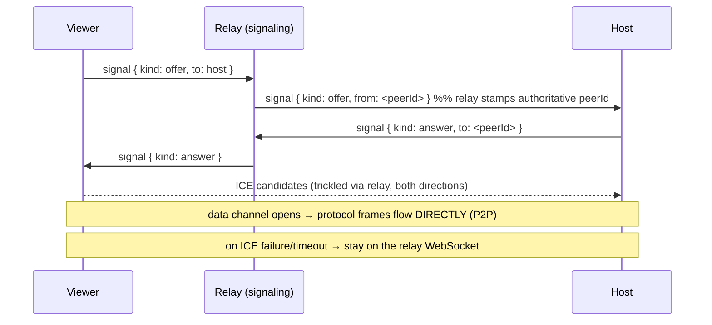

# `transport/`: session transport abstraction + WebRTC P2P

This directory owns **how** wrapper protocol frames travel between a host and a
viewer. The host (`relay/host-bridge.ts`) and viewer (`client/attach-client.ts`)
are transport-agnostic: they speak `@repo/protocol` frames through a small
`Transport` interface and never touch a socket directly.

Two transports exist:

| Transport                    | File           | Used for                                                            |
| ---------------------------- | -------------- | ------------------------------------------------------------------- |
| `WebSocketTransport`         | `transport.ts` | Relay path (always). Signaling + fallback.                          |
| `WebRtcDataChannelTransport` | `webrtc.ts`    | Direct P2P fast path (on by default; opt out with `WRAPPER_P2P=0`). |

## Why P2P

A relay is a middle hop: every keystroke echoes `viewer → relay → host → relay →
viewer`. For distant peers that's roughly 2x the RTT to the relay region, which is laggy for
interactive typing. WebRTC establishes a **direct** peer connection (NAT
traversal via STUN/ICE), giving SSH-like latency, and only falls back to the
relay when a direct path can't be formed. This mirrors how Mosh/Tailscale/SSH
think about interactive latency.

## The `Transport` interface (`transport.ts`)

A dumb, opaque byte pipe:

```ts
interface Transport {
  send(frame: string): void; // an already-encoded protocol frame; no-op if not open
  readonly isOpen: boolean;
  readonly describe: string; // short label for logs
  close(): void;
}
```

Handlers (`onOpen`/`onMessage`/`onClose`/`onError`) are passed in at
construction. Encoding/parsing stays in the host/viewer, not the transport.

## WebRTC model (`webrtc.ts`)

- **Library: `werift` (pure TypeScript).** Chosen deliberately over native
  `node-datachannel`: the CLI ships as a `bun build --compile` single binary, and
  a native `.node` addon **cannot be bundled** into that binary. werift bundles
  cleanly. (The browser/mobile viewers will use their native WebRTC instead.)
- **Signaling rides the relay.** SDP offer/answer and ICE candidates are carried
  as `signal` protocol frames over the existing relay WebSocket (see
  `apps/relay/src/hub.ts`). No extra signaling server.
- **Discovery:** the existing public Google and Twilio STUN servers. No TURN
  service or new third-party dependency was added. The authenticated Wrapper
  relay is the data fallback if ICE cannot establish a direct path.
- **`negotiateWebRtc()`** returns a `Negotiation` whose `transport` promise
  resolves with a data-channel `Transport` once the channel opens, or `null` on
  timeout/failure (so callers fall back).

### Negotiation flow



The **viewer** creates the offer + data channel; the **host** answers. The host
keeps one peer connection per viewer.

## Data path once P2P is up

- **Host** fans PTY `output` to the relay **and** every open data channel. WS
  viewers get the relay copy; P2P viewers get the data-channel copy.
- **Viewer** prefers the data channel for `input`/`resize`, and **dedups**: once
  its data channel is open it ignores the relay's duplicate `output` frames.
- If the data channel drops or stays disconnected for three seconds, the viewer
  marks it closed and resumes input/output over the relay immediately.
- ICE candidates received before the SDP offer/answer are queued until the
  remote description exists instead of being dropped.
- If the signaling WebSocket closes after P2P is open, the direct channel keeps
  the session alive. If that channel later closes too, the attach ends because
  no fallback remains.

## Security

- **Encryption:** WebRTC data channels are DTLS-encrypted end-to-end. Frames
  never traverse the relay once P2P is established.
- **Authorization:** only a viewer that already passed relay ticket auth can
  signal. The owner can join their own session; a non-owner must present the
  session's share code. Knowing a session id is not enough.
- **No peer spoofing / cross-session:** the relay assigns an authoritative
  per-viewer `peerId` and stamps the `signal.from` field (ignoring client claims);
  host→viewer signals are routed strictly by `peerId` within the same session.
  Signal payloads are capped at 64 KB.
- **Privacy note (inherent to P2P):** a direct connection exposes each peer's IP
  to the other, and STUN discloses your public IP to the STUN server. This is
  normal WebRTC behaviour; documented in `apps/cli/.env.example`.

## Enabling it

`WRAPPER_P2P` is **on by default**, so host and viewer negotiate a direct data
channel automatically and fall back to the relay if it cannot be formed. Opt out
per session with `WRAPPER_P2P=0`:

```bash
# force the relay path (no P2P)
WRAPPER_P2P=0 bun run index.ts shell-host          # then Ctrl+\ s to share
WRAPPER_P2P=0 bun run index.ts attach --relay -i <sessionId> -c <shareCode>
```

Look for `p2p data channel up` in both logs. P2P applies only to **relay**
attaches; local `127.0.0.1` attaches are already direct. A direct connection
exposes each peer's IP to the other, which is why the opt-out exists.

## Testing

- Unit-testable: the transport abstraction and the relay's signal routing
  (`apps/relay/tests/hub.test.ts`).
- **NAT traversal must be verified on two real machines/networks**, since it cannot be
  exercised in CI/sandbox. P2P is default-on, but the authenticated relay remains
  connected as the working fallback.

## Files

```text
transport.ts    Transport interface + WebSocketTransport (relay/fallback)
webrtc.ts       WebRtcDataChannelTransport + negotiateWebRtc (werift, default-on)
```
