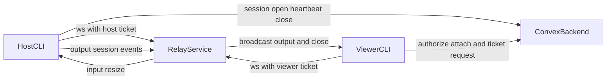

## System components

- `apps/cli`: host shell, local attach, auth commands, relay bridge, optional
  direct WebRTC transport
- `packages/backend`: Convex auth, session lifecycle, relay tickets, onboarding,
  billing
- `apps/relay`: authenticated WebSocket router for host and viewers, and the
  WebRTC signaling passthrough
- `apps/web`: Next.js app for landing, device-login approval, and onboarding
- `packages/protocol`: shared message schema and codec
- `packages/terminal`: Bun-native PTY layer using the `wrapper-pty-helper` binary
- `packages/logger`: logging and opt-in telemetry

## High level flow



## Session lifecycle

Backend handlers in `convex/session.ts`:

- `open`
- `heartbeat`
- `close`
- `listActive`
- `authorizeAttach`
- `setRelayState`

Onboarding handlers in `convex/onboarding.ts`:

- `getState`
- `completeStep`
- `complete`

Timeout safety:

- stale sessions are closed by scheduler
- relay state tracks `offline`, `connecting`, `online`, `error`

## Relay auth and routing

Backend handlers in `convex/relay.ts`:

- `issueHostTicket`
- `issueViewerTicket`
- `consumeTicket`
- `cleanupTicket`

Relay routing in `apps/relay/src/hub.ts`:

- one host socket per session
- multiple viewer sockets per session
- consensus resize from smallest viewer dimensions
- host disconnect closes viewers with `session.closed`
- `signal` frames are routed by session with an authoritative peer id so a
  viewer cannot spoof another peer

## Transports

Terminal traffic can move over two transports, both abstracted behind the
`Transport` interface in `apps/cli/transport`:

- **Relay WebSocket** (default): frames travel host to relay to viewer.
- **Direct WebRTC** (on by default, opt out with `WRAPPER_P2P=0`): the relay
  carries only the offer, answer, and ICE candidates, and the terminal bytes flow
  over a direct peer-to-peer data channel. If negotiation fails, the relay path
  keeps working.

See [Transports](/transports) for the negotiation flow and the security model.

## Session access

Access is capability-based and enforced in the backend:

- A session that is not shared is owner only.
- Sharing (`Ctrl+\` `s`) calls `session:setShareCode`, which marks the session
  shared and stores only the hash of a secret code the host prints. A non-owner
  must pass that code to `relay:issueViewerTicket` (`wrapper attach --relay --id
  <id> --code <code>`). The owner joins their own session without a code.
- Non-owner ticket requests are rate limited per user and session, and
  unsharing clears the code so outstanding tickets stop working.

Once viewers join, control is shared (every viewer can type), the terminal is
sized to the smallest viewer, and there is one host per session. See the CLI
README "Sharing and access" section for the full behavior list.

## Billing

`convex/billing.ts` exposes `createProCheckout`, which returns a Stripe checkout
URL through Autumn. Relay sharing is gated by the `can_share_relay` entitlement
on the Pro plan, and the gate fails open on billing-provider errors so an outage
cannot break sharing.

## Project structure

```text
apps/
  cli/      shell wrapping, local + relay attach, device auth, optional P2P
  relay/    authenticated WebSocket router on Fly.io
  web/      Next.js app on Vercel
  docs/     this documentation site (Mintlify)
  mobile/   git submodule pointer to the external mobile repository
packages/
  backend/            Convex: auth, sessions, tickets, onboarding, billing
  protocol/           shared Zod wire schema
  terminal/           Bun-native PTY layer
  logger/             logging and telemetry
  typescript-config/  shared tsconfig presets
tools/
  pty-helper/         C source for the wrapper-pty-helper binary
```
