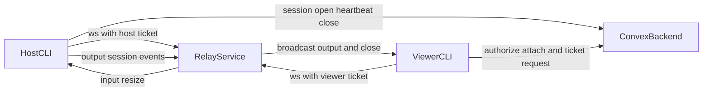

## System components

- `apps/cli`: host shell, local attach, auth commands, relay bridge
- `packages/backend`: Convex auth, session lifecycle, relay ticket APIs
- `apps/relay`: authenticated WebSocket router for host and viewers
- `packages/protocol`: shared message schema and codec

## High level flow



## Session lifecycle

Backend handlers in `convex/session.ts`:

- `open`
- `heartbeat`
- `close`
- `listActive`
- `authorizeAttach`
- `setRelayState`

Timeout safety:

- stale sessions are closed by scheduler
- relay state tracks `offline`, `connecting`, `online`, `error`

## Relay auth and routing

Backend handlers in `convex/relay.ts`:

- `issueHostTicket`
- `issueViewerTicket`
- `consumeTicket`
- `cleanupTicket`

Relay routing in `apps/relay/src/hub.ts`:

- one host socket per session
- multiple viewer sockets per session
- consensus resize from smallest viewer dimensions
- host disconnect closes viewers with `session.closed`

## Project structure

```text
apps/
  cli/
  relay/
  web/
  docs/
packages/
  backend/
  protocol/
  terminal/
  logger/
  ui/
```
