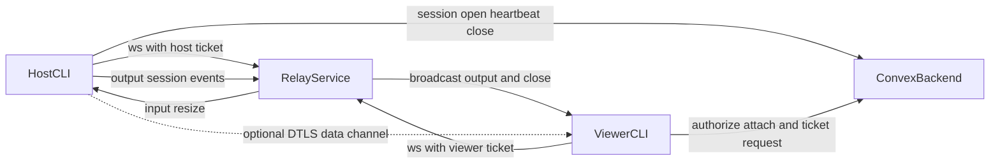

## System components

| Component           | Role                                                                                     |
| ------------------- | ---------------------------------------------------------------------------------------- |
| `apps/cli`          | Host shell, local attach, auth, relay bridge, WebRTC transport                           |
| `packages/backend`  | Convex auth, session lifecycle, tickets, onboarding, billing                             |
| `apps/relay`        | Authenticated WebSocket router and WebRTC signaling passthrough                          |
| `apps/web`          | Landing, device-login approval, onboarding, Pro checkout (yearly default), install proxy |
| `packages/protocol` | Shared JSON message schema and codec (`protocolVersion: 1`)                              |
| `packages/terminal` | Bun-native PTY layer via `wrapper-pty-helper`                                            |
| `packages/logger`   | Logging and opt-in telemetry                                                             |
| `apps/mobile`       | Native iPhone/iPad viewer; TestFlight public beta                                        |

## High-level flow

{/* TODO(image): Add /images/wrapper-architecture.webp here. Turn the flow above into a polished diagram with trust boundaries: local PTY/token, Convex auth and share-code gate, Fly relay signaling/fallback, and the encrypted P2P data path. Priority P2: useful, non-blocking documentation enhancement because the Mermaid diagram and text already carry the required information. */}

## Session lifecycle

1. `wrapper share` or `wrapper run` starts `wrapper shell-host` (`wrapper install` is optional).
2. Host creates a PTY, binds loopback WebSocket + token, and registers locally.
3. Unshared hosts send nothing to Convex.
4. Local viewers attach with the registry token. No Convex row is required.
5. Share opens a Convex session, issues a hashed share code plus host relay ticket, and starts heartbeats.
6. Viewers request viewer tickets, connect to the relay, and optionally open P2P.
7. Unshare or host exit revokes tickets, closes the Convex row, and closes remote viewers.

The backend expires stale sessions that miss heartbeats.

## Relay auth and routing

Backend-issued relay tickets are short-lived and single-use. Each session has
one host and can have multiple viewers. The relay routes terminal frames and
WebRTC signaling only within that session. Host disconnect closes every viewer.
Peer ids are assigned by the relay.

## Protocol

Wire messages are JSON validated with Zod in `@repo/protocol`. Common types:

- `session.opened` / `session.closed`
- `input` / `output` / `resize`
- `attach` / `detach`
- `error`
- `signal` (WebRTC SDP and ICE)
- `viewer.caps` (whether that viewer may type)

The relay stamps `from` on `input` and drops guest typing unless `canInput` is
true. The host enforces the same rule on P2P input.

Frames have explicit size caps (wire and terminal payload limits) before parse
and fan-out.

## Session access

- A session that is not shared is owner only.
- The owner joins a shared session without a share code.
- A non-owner needs the session id, share code, and a valid ticket.
- Access failures use a uniform denial shape.
- People you invite see output. They cannot type unless the host allows it.

See [Security and privacy](/configuration/security),
[Transports](/reference/transports), and [Pricing](/reference/pricing).
