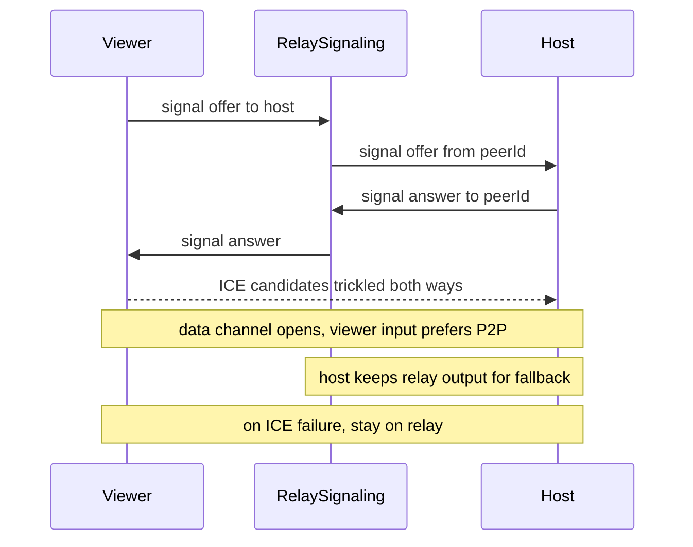

Remote sessions use two transports behind one `Transport` interface:

- **WebRTC data channel**: default direct path for lower latency
- **Relay WebSocket**: always connected for shared sessions; carries signaling
  and becomes the data path when direct connection is unavailable

Local `127.0.0.1` attach is already direct and does not use these remote paths.

## Why a direct path

WebRTC removes the relay hop for interactive latency. STUN and ICE attempt the
peer connection. Failure leaves the working relay path in place.

Public STUN servers used today:

- `stun.l.google.com:19302`
- `global.stun.twilio.com:3478`

## Negotiation flow



The viewer creates the offer and the host answers. SDP and ICE travel on the
authenticated relay connection, so there is no separate signaling service.

{/* TODO(image): Add /images/p2p-versus-relay.webp here. Show two paths side by side: direct encrypted host-to-viewer P2P and host-to-Fly-relay-to-viewer fallback. Label signaling separately from terminal data and include the `p2p`/`relay` HUD states. Priority P2: useful, non-blocking transport enhancement because the sequence diagram and text already explain both paths. */}

## Data path once P2P is up

- The host fans output to relay and to each direct viewer.
- The viewer prefers the data channel for input and resize.
- Once its channel is open, the viewer ignores duplicate relay output frames.
- A failed or disconnected data channel resumes through the relay after a short
  recovery window.
- If the signaling WebSocket dies after P2P is up, the data channel can continue
  until it also fails.
- If both paths close, attach ends.

## Security properties

- WebRTC data channels are DTLS-encrypted between peers.
- Relay fallback is TLS-encrypted in transit but processed after TLS termination.
- Signaling requires relay ticket authorization. A session id alone is not enough.
- A direct connection exposes each peer's IP to the other, and STUN discloses
  your public IP to the STUN provider.

## Defaults and opt-out

`WRAPPER_P2P` is on by default. Opt out on either end:

```bash
WRAPPER_P2P=0 wrapper shell-host
WRAPPER_P2P=0 wrapper attach --relay --id <sessionId>
```

Production relay default: `wss://wrapper-relay-prod.fly.dev`  
Development default: `ws://localhost:8080`

HUD labels: `local`, `connecting`, `relay`, `p2p`, `offline`.

See [Troubleshooting](/troubleshooting) when a remote session remains on relay.
