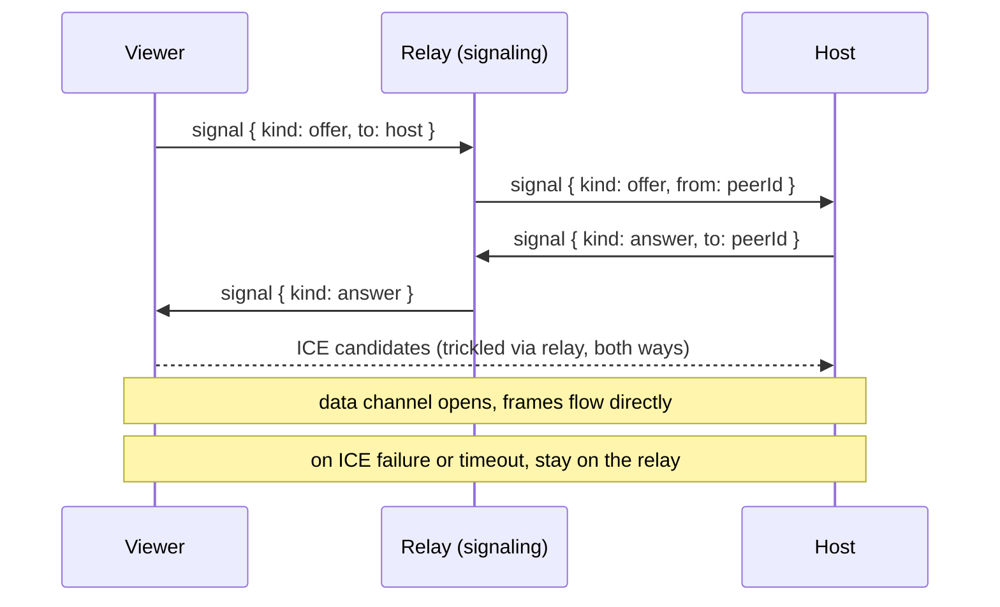

Wrapper protocol frames can travel over two transports. Both sit behind a small
`Transport` interface in `apps/cli/transport`, so the host
(`relay/host-bridge.ts`) and the viewer (`client/attach-client.ts`) never touch a
socket directly.

| Transport                  | File           | Used for                                                               |
| -------------------------- | -------------- | ---------------------------------------------------------------------- |
| Relay WebSocket            | `transport.ts` | The relay path, always. Signaling and fallback.                        |
| Direct WebRTC data channel | `webrtc.ts`    | The direct P2P fast path, on by default; opt out with `WRAPPER_P2P=0`. |

## Why a direct path

The relay is a middle hop, so every keystroke travels viewer to relay to host
and back. For peers far from the relay region that roughly doubles the round
trip and feels laggy while typing. WebRTC forms a direct peer connection (NAT
traversal via STUN and ICE) for latency closer to SSH, and it falls back to the
relay when a direct path cannot be formed.

## Negotiation flow



The viewer creates the offer and the data channel, and the host answers. The
host keeps one peer connection per viewer. SDP and ICE payloads ride the
existing relay WebSocket as `signal` protocol frames, so there is no separate
signaling server. Discovery uses public STUN servers, and the relay is the
fallback if ICE cannot connect in time.

## Data path once P2P is up

- The host fans PTY output to the relay and to every open data channel. Relay
  viewers get the relay copy, and P2P viewers get the data-channel copy.
- The viewer prefers the data channel for input and resize, and once its channel
  is open it ignores the relay's duplicate output frames.
- If the data channel drops, both sides revert to the relay automatically.

## Security

- Data channels are DTLS-encrypted end to end. Once P2P is established, frames
  never traverse the relay.
- Only a viewer that already passed relay ticket auth (which checks ownership or
  a shared session) can signal, so only authorized peers form a P2P connection.
- The relay assigns an authoritative per-viewer peer id and stamps the
  `signal.from` field, ignoring client claims. Host to viewer signals are routed
  strictly by peer id within the same session, and signal payloads are capped at
  64 KB.
- A direct connection exposes each peer's IP to the other, and STUN discloses
  your public IP to the STUN server. This is normal WebRTC behavior and is noted
  in `apps/cli/.env.example`.

## Enabling it

`WRAPPER_P2P` is on by default, so host and viewer negotiate a direct data
channel automatically and fall back to the relay if it cannot be formed. Opt out
per session on either end with `WRAPPER_P2P=0`:

```bash
# force the relay path (no P2P)
WRAPPER_P2P=0 wrapper shell-host          # then Ctrl+\ s to share
WRAPPER_P2P=0 wrapper attach --relay -i <sessionId> -c <shareCode>
```

Look for `p2p data channel up` in both logs. P2P applies only to relay attaches;
local `127.0.0.1` attaches are already direct.

## Why werift

The CLI ships as a single compiled binary (`bun build --compile`). A native
`.node` WebRTC addon cannot be bundled into that binary, so the CLI uses
`werift`, a pure TypeScript WebRTC implementation, which bundles cleanly. Browser
and mobile viewers use their own native WebRTC.

## Testing

The transport abstraction and the relay signal routing are unit tested
(`apps/relay/tests/hub.test.ts`). Real NAT traversal must be verified on two
machines on different networks, since it cannot run in CI or a sandbox. Because
the flag defaults off and the relay is the fallback, enabling P2P cannot regress
the working relay path.
