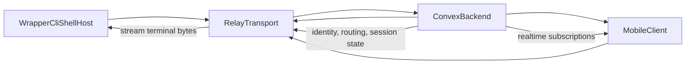

# `@repo/backend` (planned) - Convex backend blueprint

This package documents the backend architecture for Wrapper.

It is intentionally docs-first right now: no implementation yet, only the
baseline contract for Phase 2 and onward.

## Why this package exists

The CLI already has local PTY + attach flow. To make Wrapper truly remote and
multi-device, we need backend ownership for identity, routing, state, and ops.

This package defines that backend baseline so implementation stays coherent.

## Scope boundaries

Backend owns:

- auth-linked identity and authorization
- session lifecycle source of truth
- relay routing metadata
- realtime state sync
- push token management + notification triggers
- operational/audit events

Backend does not own:

- local PTY byte handling (CLI)
- local attach protocol plumbing (CLI local server)
- terminal UI rendering (attach/mobile clients)

## Core entities (Convex model)

Minimum tables/collections:

- `users`
- `devices`
- `sessions`
- `sessionConnections`
- `sessionEvents`
- `pushTokens`
- `auditLogs`

Every row must be tenant-safe and user-scoped.

## Baseline API surface

Required backend functions:

- `session.open`
- `session.heartbeat`
- `session.share`
- `session.unshare`
- `session.close`
- `session.listActive`
- `device.registerPushToken`
- `device.unregisterPushToken`

## Auth integration (Better Auth)

Backend should accept verified user identity from Better Auth and map it to:

- canonical user record
- per-device identity (`host-cli`, `mobile-ios`, future clients)

Never trust caller-provided `userId`; derive authorization from verified auth
context in every mutation/action.

## Relay + Convex responsibility split

- Relay carries transport streams.
- Convex stores truth and authorization.
- Clients subscribe to Convex for session state transitions.

## Reliability baseline

Implement early:

- heartbeat expiry / stale session cleanup
- idempotency guards on open/close
- dedupe window for repeated push triggers
- event correlation ids (`sessionId`, `connectionId`, `requestId`)

## Notification baseline

Push notifications should trigger on high-signal events:

- session shared
- viewer attached
- session closed

Then evolve to smarter heuristics in Phase 5.

## Phase mapping

### Phase 2 (next)

- auth + identity model
- session lifecycle APIs
- routing metadata for relay
- minimal realtime subscriptions

### Phase 3

- mobile client integration
- APNs pipeline tied to `pushTokens`

### Phase 5

- notification intelligence and policy
- suppression, dedupe, priority tuning

## MVP-first implementation order

1. auth + users/devices
2. sessions + lifecycle mutations
3. routing metadata + authorization checks
4. realtime subscriptions
5. push token registration + basic push triggers
6. cleanup jobs + audit views

## Deliverable target for this package

When backend coding begins, this package should be expanded with:

- concrete Convex schema docs
- API contract docs
- operational runbook for local/dev/prod
